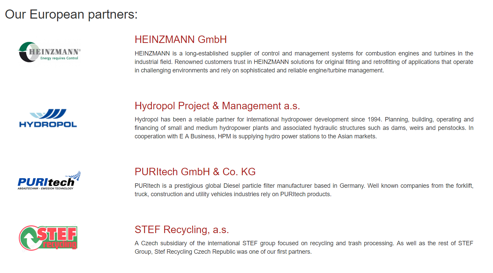

# E.A. Bussiness
## **Zadání projektu**
Převod již existujících statických stránek na stránky dynamické, které budou pomocí administrátorského přístupu, který bude vytvořen přímo v databázi, mít možnost editovat jednotlivé posty(se jménem, logem, odkazem a textem daného partnera). Backend bude psaný v PHP a bude převážně psán stylem OOP, který využívá "model-view-controller" framework. Stránka bude multijazyčná, kdy výběr jazyku bude uložen v cookies. Formulář, přes který se budou jednotlivé posty přidávat a editovat budou kontrolované pomocí Javascriptu. Grid stránek a částečně i kaskády hlavních stránek (Home, About us, Europe, Asia) budou podpořené knihovnou Bootstrap. 
Stránka BLOG bude vytvořena od základů bez použití cizích knihoven. Budou se sem dynamicky přidávat posty za použití již zakomponovaného systému na hlavních stránkách a pro neadmin uživatele bude možnost se registrovat a upravovat profil.  Uživatelé pak následně budou moci vkládat komentáře pod články. Podporou pro tento systém budou sessions, cookies a databáze. Vše bude psáno tak, aby přidání dalších funkcí, jazyků, částí světa a tak bylo jednoduché i přes neznání celého systému.

## **Implementace**
Pro vytvoření webové apliakce jsem se rozhodl pro OOP přístup pro rozšíření mých znalostí. Podle tutoriálů a dokumentací jsem si vytvořil vlastní MVC network a tíms tvořil základ celé aplikace. Pro CSS využívám knihovny Bootstrap pro jednodušší práci s gridem a k pomoci základnímu nastylování stránky (byl zvolen také proto, že původní stránka byla také psána s využitím Bootstrapu). Pro vylepšení vzhledu JavaScript alertů byla využita knihova SweetAlert.

Načtení aplikace začne includem všech php dokumentů. Základní stránka, index obsahuje navbar a footer, které zůstávají statické pro všechny jednotlivé stránky. Mezi nimi aplikace vyžaduje tzv. view, který se zobrazuje podle toho, který view uživatel HTTP requestem vyžaduje.

### **Jazykové mutace**
Jazykové mutace jsou řešeny následujícím způsobem. Defaultně je nastavena jazyková cookie na angličtinu. Aplikace si toho při načtení hlavního indexu, který je vždy aktivní, všimne a vyžádá si jazykový PHP soubor, který obsahuje proměnné, které obsahují slova/věty, které se dají pak jednoduše implementovat v aplikaci pomocí PHP. Pokud uživatel vyžádá jinou jazykovou mutaci, je stránka redirectována na prázdnou stránku, která uživatele vrací hned zpět, kde se uživatel nacházel v předešlém kroku. K tomuto jsem se přichýlil po zjištění, že cookie trvá jeden refresh, enž si jich aplikace všimne a tudíž je to řešeno přes redirect, který uživatel ani nezaznamená. Tento systém je jednoduchý pro následovné přidání další ajzykové mutace nebo dalších proměnných pro rozšíření stránek. Text psán v angličtině a pak přeložen hromadně pomocí Google překladače.

### **Postování příspěvků/sponzorů**
Pokud je uživatel přihlášen jako administrátor, má možnost pomocí formulářů přidávat příspěvky/sponzory. Kontrola formulářu je dělaná jak v HTML pomocí pattern a required, tak pomocí Javascriptu a funkcí, tak backendově pomocí PHP. Veškerý uživatelský vstup je sanitován proti injekcím. Bylo naraženo na problém, jak jednoduše dovolit adminovi přidávání obrázků. Toto je řešené pomocí http requestu, kdy po zadání jména a přípony souboru bude uživatel upomenut, zda se soubor na webhostingu nachází a pokud ne, kam ten soubor vložit. Zbytek příspěvků je ukládán do MySQL databáze, kdy využívám PDO příkazů.

### **Databáze**
Databáze obsahuje 5 tabulek. 
1. **Admin** - obsahuje přihlašovací jména a hashovaná hesla pro admin přístup
1. **Users** - obsahuje přihlašovací jména a hashovaná hesla pro uživatelský přístup a další přídavné informace, které může uživatel měnit v profilu svého účtu
1. **Posts** - obsahuje informace o postech sponzorů, jejich jazykové mutace, země původu, informace, odkazy...
1. **Blog_posts** - obsahuje příspěvky adminů do osobního blogu (text, nadpis, odkaz k obrázku)
1. **Comments** - obsahuje komentáře (id komentáře a uživatele, který jej napsal, samotný komentář a čas přidání komentáře)

## **Manuál**
Zde popíšu každou stránku zvlášť a její možnosti.
### **Homepage**
Základní informace a odkazy na další záložky. Nic zajímavého.

### **About us**
Informace o společnosti, kontakty a obecné informace. Nic technicky zajímavého.

### **Europe**
Pro tuto stránku je na backendu připraven SQL příkaz, který ví, že má vytáhnout z databáze sponzory a klienty z Evropy a z cookie si vytáhne, v jaké jazykové mutaci má data vytáhnout. Zároveň jsou data tažená již abecedně sežazená. Po úspěšném SQL příkazu je iterováno mezi daty a jsou postupně zobrazovány. Při přihlášení jako admin se u příspěvku objeví editovací ikona, která dovolí příspěvek editovat. Je zde využíváno query v URL.

### **Asia**
Stejný přístup jako pro Evropu.

### **Blog**
Na této stránce jsou přidané příspěvky blogu pomocí formuláře. Při přihlášení jako admin jde příspěvky přidávat a zároveň i editovat. Příspěvky se ředí podle data přidání. Nejnovější nahoře. Pro tuto část již není dělaná jazyková mutace.

### **Příspěvek blogu**
Po kliknutí na Read More se uživatel dostane k příspěvku, který se mu zobrazí celý a zároveň, pokud je přihlášený, má možnost přidávat komentáře. Uživatel může své komentáře i mazat. Admin má možnost mazat všechny komentáře a editovat samotný příspěvek.

## **Přihlašování**
### **Admin**
Pro přihlášení jako admin je třeba kliknout na odkaz admin v levé části footeru. Přihlašovací jméno i heslo jsou "admin" (bez uvozovek).

##### **Add a post**
Ve footeru je možnsot kliknou na Add Post, kde je adminovi nabídnuta možnost přidat klienta do databáze.

##### **Edit**
Jednotná ikona pro všechny edit akce. Lze editovat záznamy o klientech a zároveň i editovat blogové příspěvky.

##### **Delete**
U komentářů uživatelů je možnost mazat agresivní a nechtěné komentáře.

##### **Add a blog post**
Přesměrování na formulář, kde je možnost přidat příspěvek a používat i HTML syntaxe pro úpravu vzhledu příspěvku.

### **Uživatel**
##### **Registration**
Pro registraci musí uživatel poskytnout uživatelské jméno, email a dostatečně silné heslo. Toto heslo se hashuje a solí pomocí funkce PHP password_hash, která podle dokumentace vyhovuje požadavkům na hashování v současné době a je aktualizována. 

##### **Login**
Klasický přihlašovací formulář. Po uživateli je žádána správná kombinace hesla a emailu, které použil při registraci. 

##### **Profile**
Uživateli je po kliknutí na odkaz [uživatelské_jméno] Profile zobrazen jejich profil, který ze začátku vypadá velmi nudně a v základu v něm je jen Uživatelské jméno, email a defaultní profilový obrázek.

##### **Edit Profile**
Na tomto odkazu může uživatel vylepšit svůj profil o informace, které chce a změnit si svůj profilový obrázek.

##### **Add comment**
Při prohlížení blogových příspěvků má uživatel možnsot se k danému příspěvku vyjádřit formou komentáře. Bohužel mu není dovoleno stylizovat komentář pomocí HTML tagů kvůli předpokladu zlého uživatele a JavaScript injekcí.

